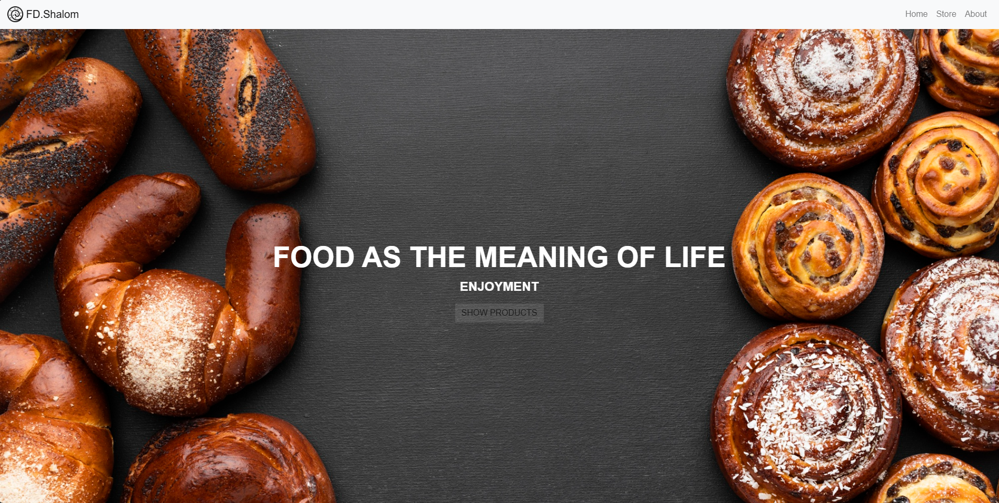
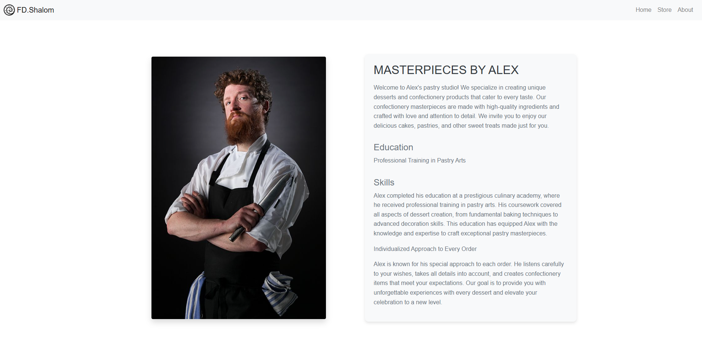
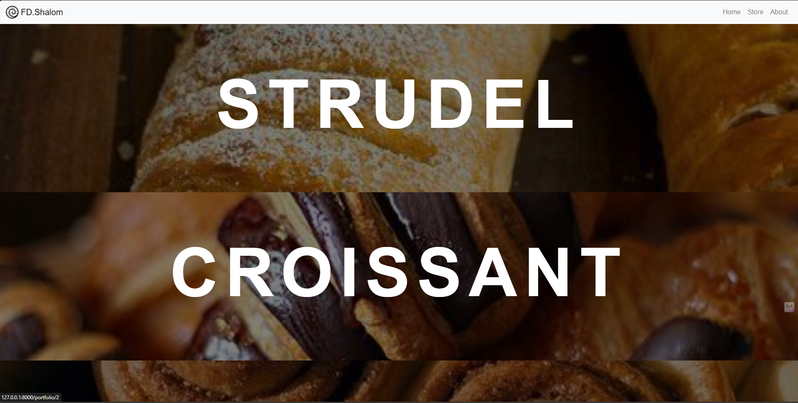
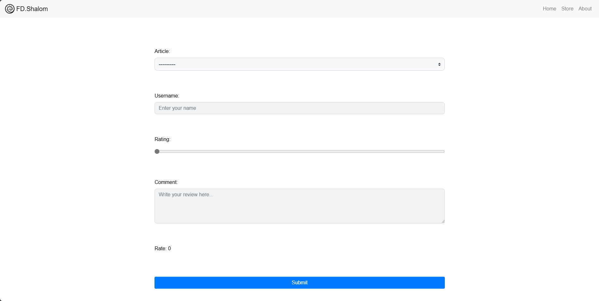

Bakery Website

 <!-- Main screenshot of your site goes here -->

## 🌟 Project Overview

[**FdShalom**] is a bakery website where visitors can explore our freshly baked goods, view products, read reviews, and share their own feedback. The site features a modern design, mobile responsiveness, and interactive elements to enhance the user experience.

### Key Features:
- 🛍️ **Homepage:** An inviting introduction to our bakery, highlighting our signature products.
- 🍰 **Products Page:** A detailed list of available baked goods, complete with descriptions and prices.
- ⭐ **Reviews Page:** Customer ratings and feedback showcasing our delicious offerings.
- 📝 **Feedback Form:** A simple form for customers to submit their feedback and experiences.
- 👤 **About Me Page:** Information about our bakery's story and mission.

---

## 🖼️ Screenshots

### About Me Page
 <!-- Add screenshot of the about me page -->

### Products Page
 <!-- Add screenshot of the products page -->

### Reviews Page
 <!-- Add screenshot of the reviews page -->

### Feedback Form Page
 <!-- Add screenshot of the feedback form page -->

---

## 🚀 Technologies Used

- **Frontend:**
  - HTML5
  - CSS3
  - Bootstrap for responsive design

- **Backend:**
  - PostgreSQL for storing information about products and reviews
  - Dynamic pages for rendering content based on user interactions

---
